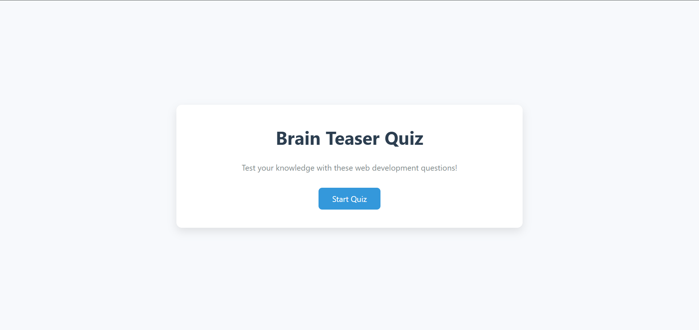
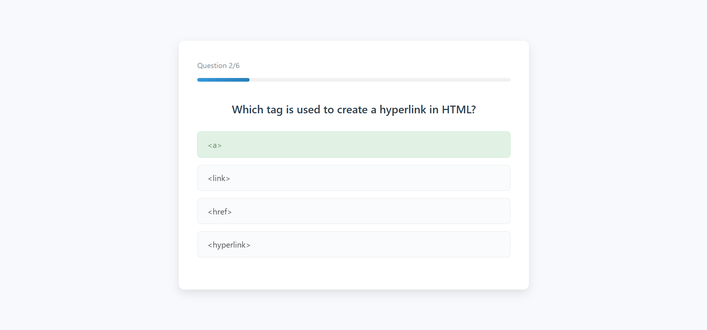
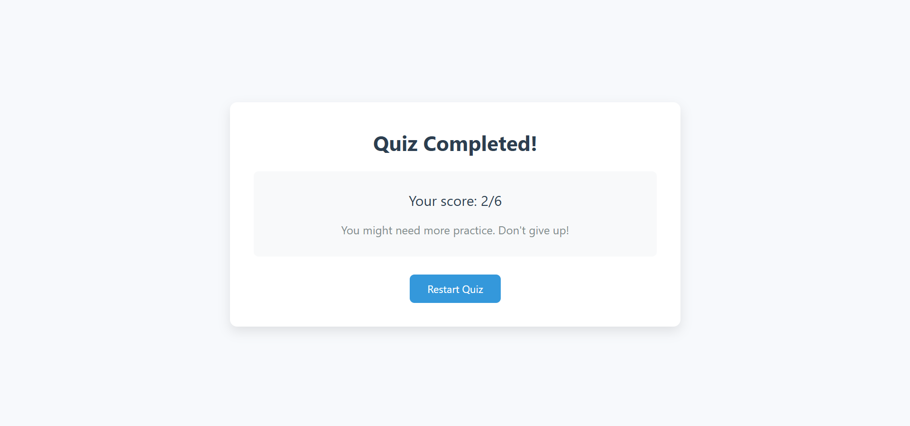

# Quiz App - DevLab Internship Project

A responsive multiple-choice quiz application that tests users on web development knowledge. The app presents questions one at a time, provides immediate feedback, tracks progress, and displays a final score.

## 📝 Description

This Quiz App is a simple yet interactive web application built as part of the DevLab Internship Program. It features a clean, user-friendly interface that allows users to test their knowledge of HTML, CSS, and JavaScript through a series of multiple-choice questions. The app provides immediate feedback on answers, tracks the user's progress, and displays a final score upon completion.

## 🛠️ Technologies Used

- **HTML5**: Page structure and content
- **CSS3**: Styling and responsive design
- **JavaScript**: Quiz logic and dynamic content
- **LocalStorage API**: Saving high scores

## ✨ Features

- Clean, minimalist user interface
- Dynamic question loading
- Immediate answer feedback with visual cues
- Progress tracking (question counter and progress bar)
- Final score calculation and personalized feedback
- Option to restart the quiz
- High score saving using localStorage
- Optional timer functionality
- Fully responsive design for mobile and desktop

## 🚀 How to Run

1. Clone this repository:
   ```
   git clone https://github.com/Mister2314/quiz-app-devlab.git
   ```

2. Navigate to the project directory:
   ```
   cd quiz-app-devlab
   ```

3. Open `index.html` in your preferred web browser:
   - Double-click the file in your file explorer
   - Or open it via command line:
     ```
     open index.html    # macOS
     start index.html   # Windows
     xdg-open index.html # Linux
     ```

4. No build process or dependencies required!

## 📸 Screenshots

### Start Screen


### Question Screen


### Results Screen


## 👨‍💻 Author

[Hüseynli Xəyal] - DevLab Internship Program

